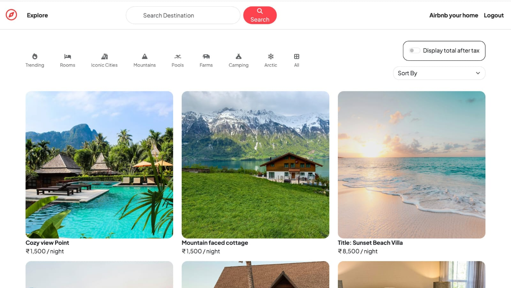
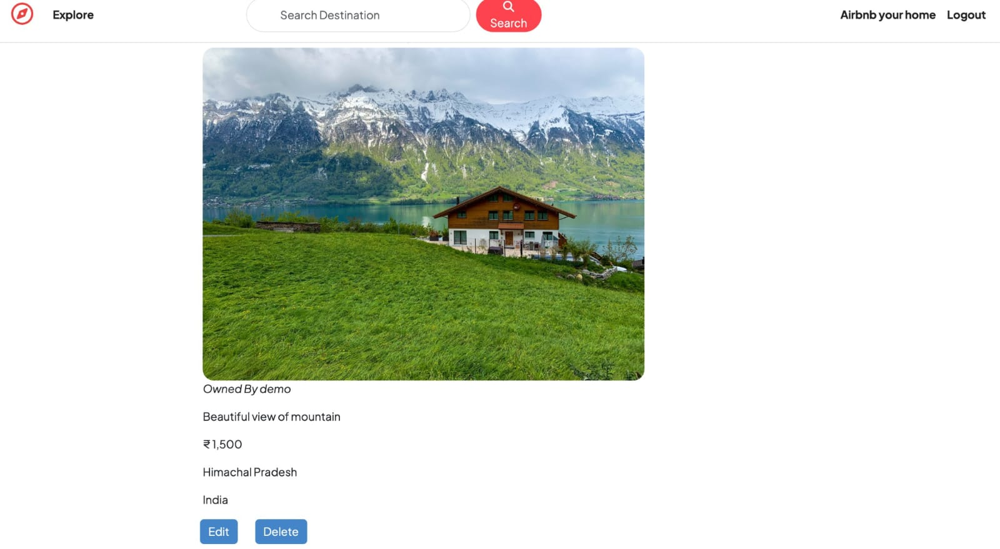
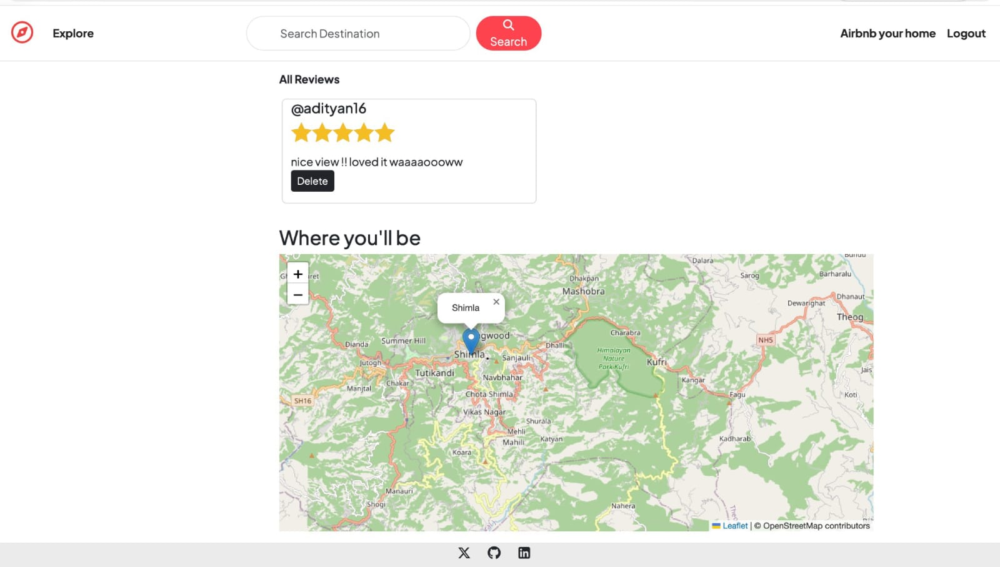
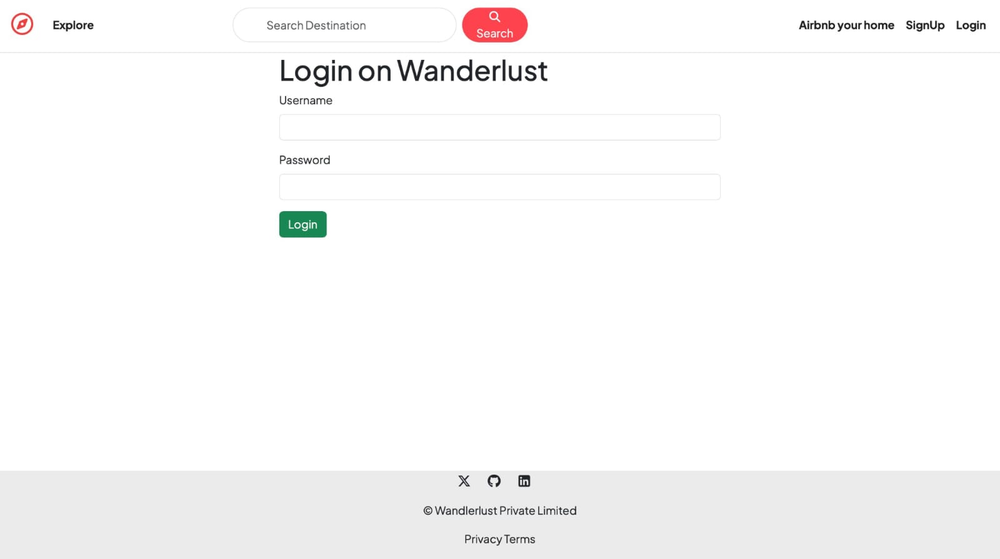
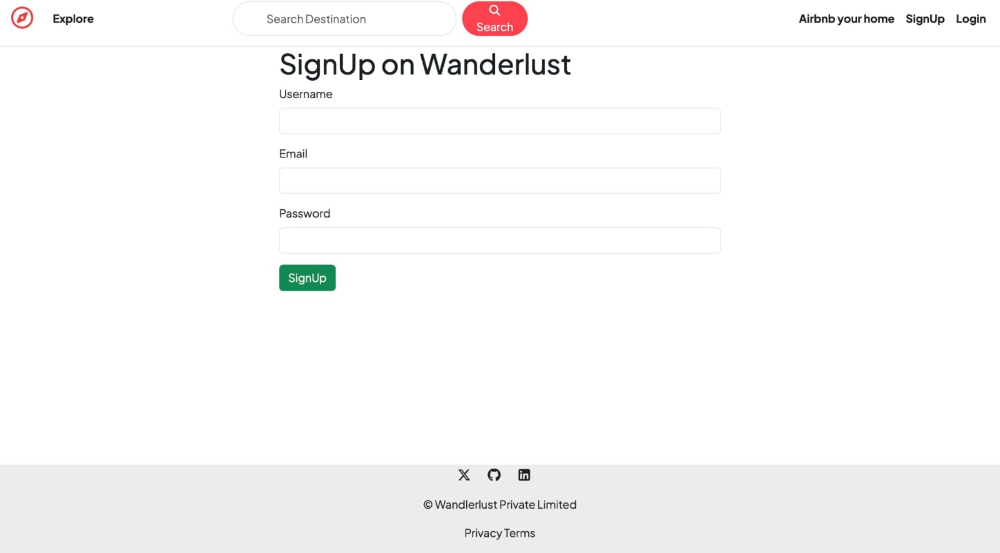
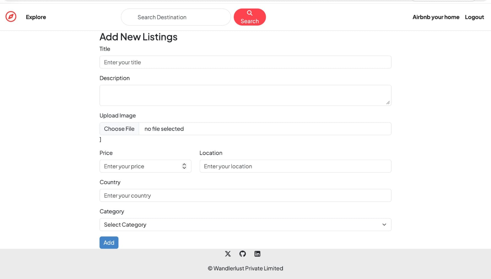
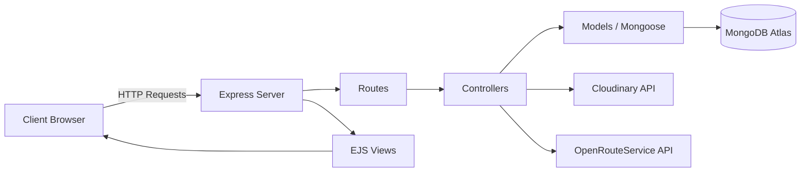
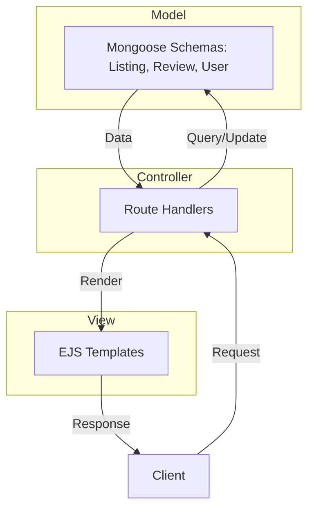
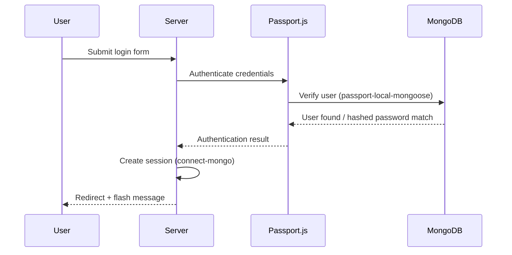
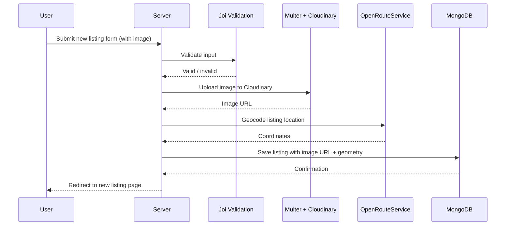

# 🌍 Wanderlust

Wanderlust is a full-stack accommodation booking platform inspired by Airbnb. Users can explore, list, and review travel stays — from cozy pool-side retreats to mountain-facing cottages — with real-time search, category filtering, price sorting, and interactive location maps. Built with Node.js, Express, and MongoDB following the MVC pattern.

[](https://nodejs.org/)
[](https://expressjs.com/)
[](https://www.mongodb.com/)
[](https://render.com/)
[]()
[]()

**🔗 Live Demo:** [wanderlust-1gbz.onrender.com](https://wanderlust-1gbz.onrender.com)

---

## 📑 Table of Contents

- [Features](#-features)
- [Screenshots](#-screenshots)
- [Architecture](#-architecture)
- [Tech Stack](#-tech-stack)
- [Getting Started](#-getting-started)
- [Environment Variables](#-environment-variables)
- [Folder Structure](#-folder-structure)
- [Security](#-security)
- [Learning Outcomes](#-learning-outcomes)
- [Future Scope](#-future-scope)
- [Deployment](#-deployment)
- [API Integration](#-api-integration)
- [Contributing](#-contributing)
- [License](#-license)
- [Author](#-author)

---

## ✨ Features

**Discovery & Browsing**
- 🔎 Search listings by destination
- 🗂️ Filter by category (Trending, Rooms, Iconic Cities, Mountains, Castles, Pools, Farms, Camping, Arctic, All)
- 🔃 Sort listings by price (low to high / high to low)
- 💰 Toggle to display total price after tax

**Listings**
- 🏠 Create, view, edit, and delete property listings
- 📸 Image uploads via Multer and Cloudinary
- 🗺️ Interactive maps with geocoding (OpenRouteService)

**Reviews**
- ⭐ Add, view, and delete reviews and ratings on listings

**Authentication & Sessions**
- 🔐 Sign up, log in, and log out with Passport.js
- 🔒 Persistent sessions with `express-session` and `connect-mongo`
- 💬 Flash messages for success/error feedback

---

## 📸 Screenshots








---

## 🏗️ Architecture

**High-Level Architecture**



**MVC Architecture**



**Authentication Flow**



**Create Listing Flow**



---

## 🛠️ Tech Stack

**Frontend**
- EJS, EJS-Mate (templating)
- HTML5, CSS3, Bootstrap
- Font Awesome (icons)

**Backend**
- Node.js
- Express.js

**Database**
- MongoDB
- Mongoose (ODM)

**Authentication**
- Passport.js
- Passport-Local-Mongoose
- express-session, connect-mongo

**Cloud Services**
- Cloudinary (image storage & delivery)
- Multer + multer-storage-cloudinary (file uploads)

**APIs**
- OpenRouteService (geocoding & maps)

**Deployment**
- Render (hosting)
- MongoDB Atlas (database)

---

## 🚀 Getting Started

### Prerequisites

- [Node.js](https://nodejs.org/) (v26.5.0 or compatible)
- [MongoDB](https://www.mongodb.com/) (local or Atlas)
- A [Cloudinary](https://cloudinary.com/) account
- An [OpenRouteService](https://openrouteservice.org/) API key

### Installation

1. **Clone the repository**
   ```bash
   git clone https://github.com/anayojha/Wanderlust.git
   cd Wanderlust
   ```

2. **Install dependencies**
   ```bash
   npm install
   ```

3. **Set up environment variables**

   Create a `.env` file in the root directory (see [Environment Variables](#-environment-variables) below).

4. **Run the application**
   ```bash
   node app.js
   ```

5. **Open in your browser**
   ```
   http://localhost:8080
   ```

---

## 🔑 Environment Variables

Create a `.env` file in the project root with the following:

```env
ATLASDB_URL=your_mongodb_connection_string
SECRET=your_session_secret
CLOUD_NAME=your_cloudinary_cloud_name
CLOUD_API_KEY=your_cloudinary_api_key
CLOUD_API_SECRET=your_cloudinary_api_secret
ORS_API_KEY=your_openrouteservice_api_key
```

| Variable | Purpose |
|---|---|
| `ATLASDB_URL` | MongoDB Atlas connection string |
| `SECRET` | Session/cookie signing secret |
| `CLOUD_NAME` | Cloudinary account cloud name |
| `CLOUD_API_KEY` | Cloudinary API key |
| `CLOUD_API_SECRET` | Cloudinary API secret |
| `ORS_API_KEY` | OpenRouteService API key for geocoding/maps |

---

## 📁 Folder Structure

```
Wanderlust/
├── controllers/       # Route handler logic
├── init/              # Database seeding/initialization scripts
├── models/            # Mongoose schemas (Listing, Review, User, etc.)
├── public/            # Static assets (CSS, JS, images)
├── routes/            # Express route definitions
├── utils/             # Helper functions and utilities
├── views/             # EJS templates
├── app.js             # Application entry point
├── cloudConfig.js      # Cloudinary configuration
├── middleware.js       # Custom middleware (auth checks, validation, etc.)
├── schema.js            # Joi validation schemas
├── updateGeometry.js     # Script to update listing geolocation data
├── package.json
└── .gitignore
```

---

## 🛡️ Security

- **Passport-Local-Mongoose** for secure credential storage and authentication
- **Password hashing** handled automatically via Passport-Local-Mongoose (no plaintext passwords stored)
- **Authentication & Authorization** checks via custom middleware to protect routes and restrict edit/delete actions to listing owners
- **Joi validation** on all incoming listing and review data to prevent malformed input
- **MongoDB injection prevention** through Mongoose schema typing and validation
- **Session-based login** with secure, server-side session storage via `connect-mongo`

---

## 📚 Learning Outcomes

Building Wanderlust helped strengthen hands-on experience with:

- Structuring a full application using the **MVC pattern**
- Designing and consuming **RESTful routes**
- Implementing **authentication and authorization** from scratch with Passport.js
- Handling **file uploads** and integrating third-party storage (Cloudinary)
- Working with **geocoding APIs** to convert addresses into map coordinates
- **Deploying** a Node.js/Express app with a live database to production

---

## 🔮 Future Scope

- 📅 Booking system with availability calendar
- 💳 Payment gateway integration
- ❤️ Wishlist / Favorites for saved listings
- 👤 User profile pages
- 🛠️ Admin dashboard for managing listings and users

---

## ☁️ Deployment

- **Hosting:** Render
- **Database:** MongoDB Atlas
- **Image Storage:** Cloudinary

---

## 🔌 API Integration

- **[OpenRouteService](https://openrouteservice.org/)** — geocoding listing addresses into coordinates for map display
- **[Cloudinary](https://cloudinary.com/)** — image upload, storage, and delivery

---

## 🤝 Contributing

Contributions are welcome! To contribute:

1. Fork the repository
2. Create a new branch (`git checkout -b feature/your-feature`)
3. Commit your changes (`git commit -m "Add some feature"`)
4. Push to the branch (`git push origin feature/your-feature`)
5. Open a Pull Request

---

## 📄 License

All rights reserved. This project is not currently licensed for reuse, modification, or distribution without permission from the author.

---

## 👤 Author

**Anay Ojha**
GitHub: [@anayojha](https://github.com/anayojha)
